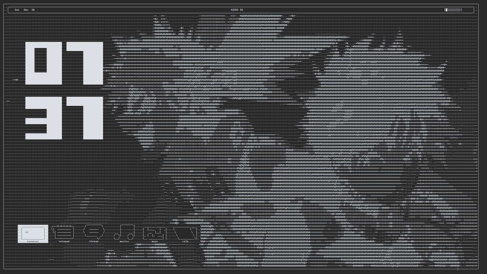
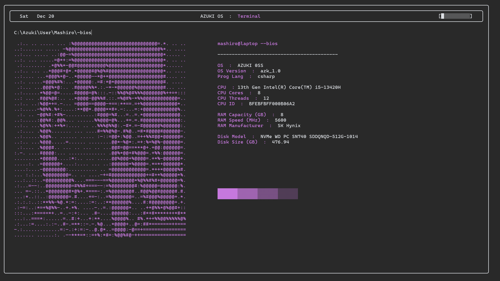
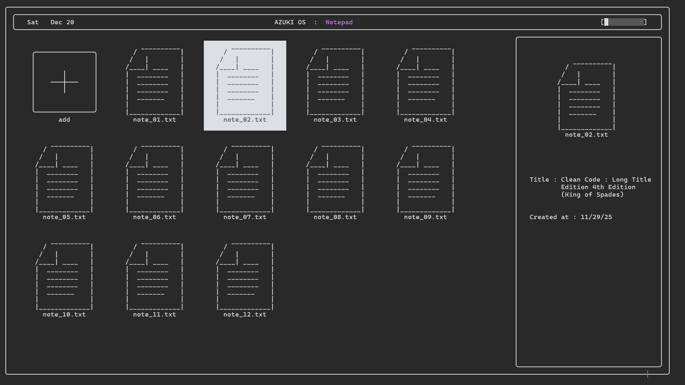
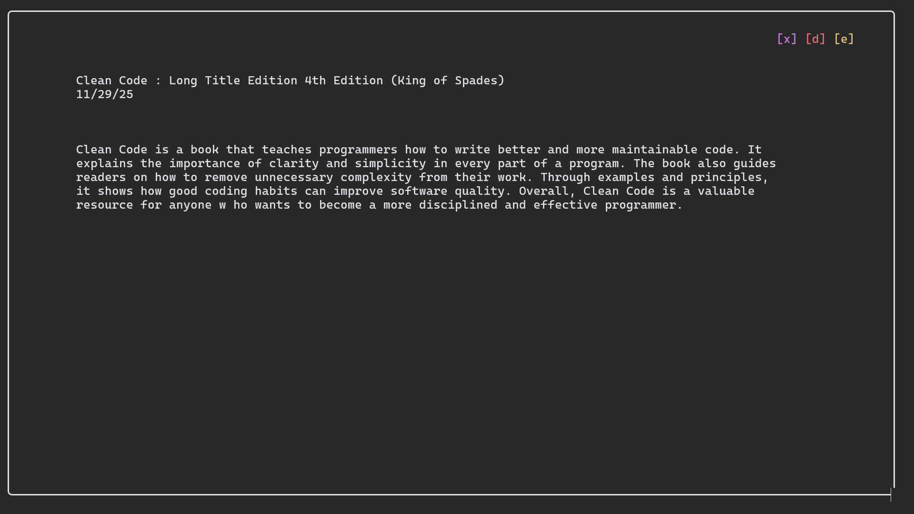
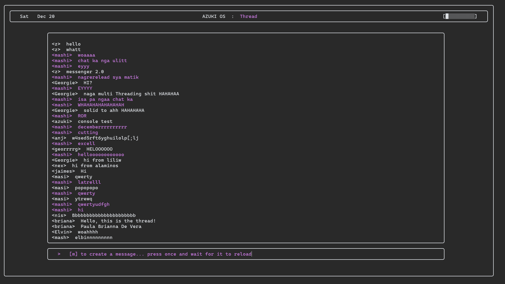
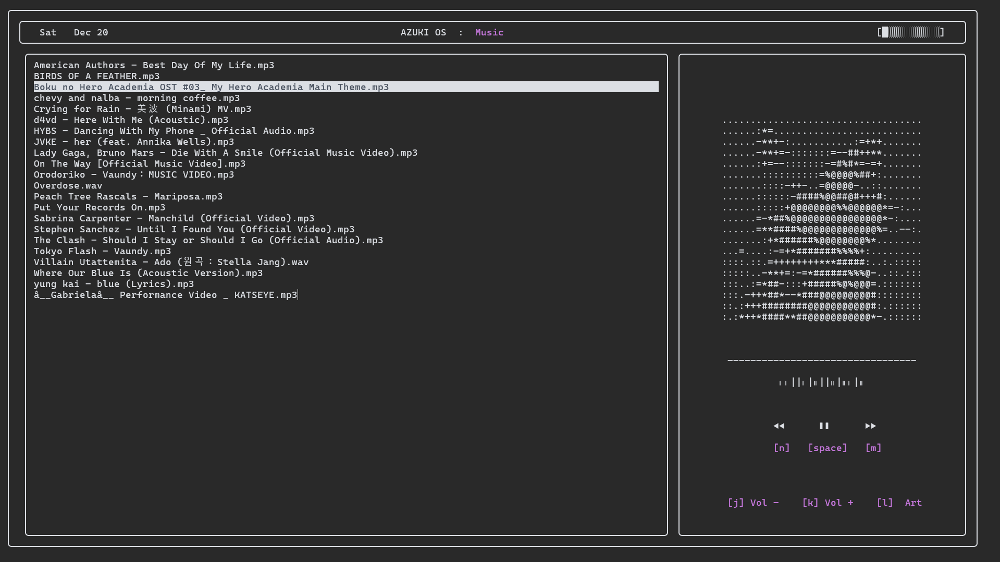
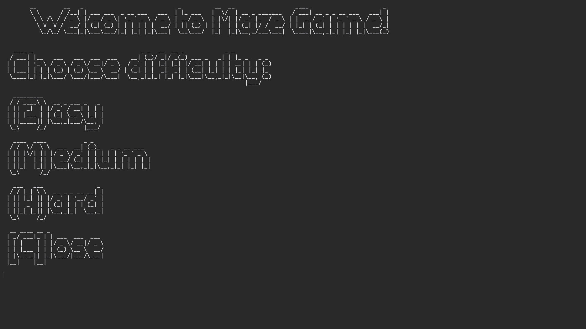
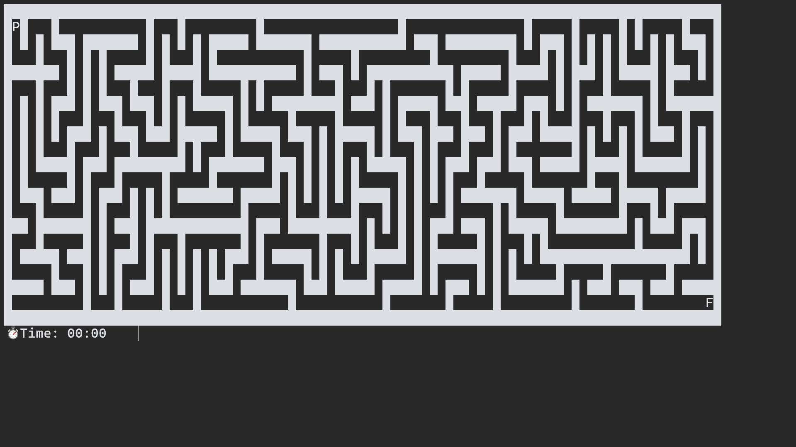
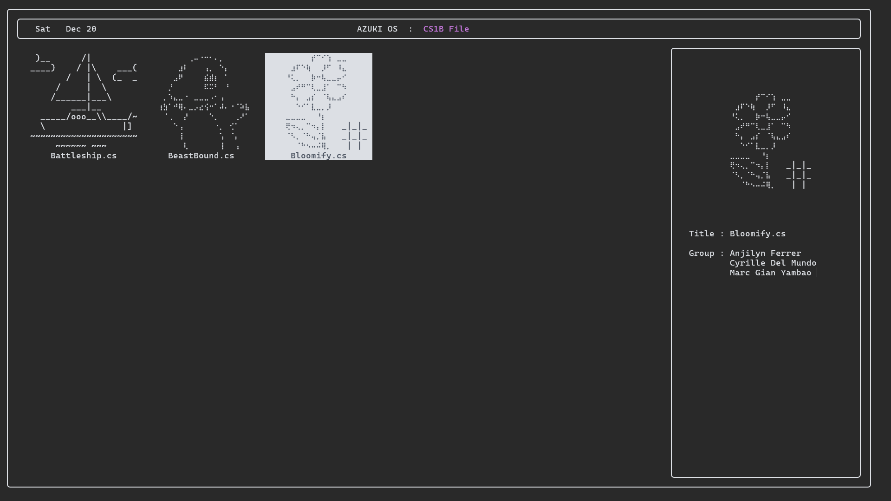

<p align="center">
  <a href="https://www.youtube.com/watch?v=u9v3hWOOSOY">
    
  </a>
</p>

---

# AZUKI Operating System Simulation

AZUKI is a console-based operating system simulation built in C#. It replicates core operating system concepts using an ASCII-art interface inside the terminal. The project combines navigation systems, GUI-like layouts, multithreading, online APIs, and local database integration to simulate a virtual computer environment.

---

## Features

### Home Screen
Customizable ASCII-based homescreen with wallpapers, widgets, taskbar, battery display, and date/time system.



---

### Terminal Application
Linux-inspired terminal with custom commands for navigation, customization, AI interaction, BIOS viewing, pets, and system control.

Commands:
- `-x` → Close terminal
- `-w` → Change wallpaper
- `-l` → Change layout
- `-pet` → Collect/view pets
- `-bios` → BIOS information
- `wtf` → Ask AI questions
- `motivate me` → AI motivation
- `cls` → Clear screen



---

### Notepad Application
Console-based notepad with CRUD operations using a local database for persistent note storage.




---

### Thread Application
Real-time online messaging system using APIs, HTTPS, and online database connectivity.



---

### Music Player
Multithreaded music player that allows background audio playback while navigating the OS.



---

### Maze Game
ASCII-based maze game demonstrating real-time input handling and terminal rendering.

Developed by : Jaimes Jairelle Oreto





---

### CS1B Folder
Collection of CS1B console applications executable through batch processing inside AZUKI.



---

## Technical Highlights

- ASCII-based GUI system
- Precise cursor positioning using `SetCursorPosition`
- GUI-like layouts in CLI environment
- Multithreading support
- Local and online database integration
- HTTPS and API communication
- Batch file execution support

---

## Technologies Used

- C#
- .NET Console Application
- Multithreading
- Local Database
- Online APIs
- HTTPS Connections

---

## Project Structure

```text
AZUKI/
├── Program.cs                              # Main application entry point
├── azuki_project.csproj                    # .NET project configuration
├── RUN.bat                                 # Quick launcher script

// Core
├── Style_Root.cs                       # ASCII assets, fonts, and UI styles
├── Frontend_Asset.cs                   # ASCII rendering and display utilities
├── App_Setup.cs                        # Core frontend initialization methods
├── Frontend_Setup.cs                   # Desktop and homescreen interface system
├── Wallpaper.cs                        # Wallpaper and background manager
├── env.cs                              # Environment configuration
├── env_private.cs                      # Private environment variables / API keys
└── notepad.json                        # Local database storage for Notepad

// Applications
├── App_Terminal.cs                     # Linux-inspired terminal application
├── App_Terminal_Pet.cs                 # ASCII pet collection system
├── App_Notepad.cs                      # Notepad application with CRUD support
├── App_Music.cs                        # Multithreaded music player
├── App_Music_Setup.cs                  # Music player configuration and setup
├── App_Thread.cs                       # Online messaging and thread system
└── App_Cs1b.cs                         # CS1B application launcher module

// Maze
├── Maze.cs                             # Maze generation logic
├── MazeGame.cs                         # Maze gameplay mechanics
├── Maze_Setup.cs                       # Maze initialization and rendering
└── Player.cs                           # Player movement and controls

// Batch for CS1B Folder
├── cs1b_battleship.bat                 # Launch Battleship project
├── cs1b_beastbound.bat                 # Launch Beastbound project
└── cs1b_bloomify.bat                   # Launch Bloomify project

├── bin/                                    # Compiled application binaries
└── obj/                                    # Build cache and temporary files
```

---

## Installation

Run using:

```bash
RUN.bat
```

or

```bash
dotnet run
```

This project is made and designed for Windows 11 and run using default CMD Terminal, so it takes some tweaks to run for Mac and Linux.

This project still has bugs that causes it to crash, especially in Thread Application and window terminal resizing.

---

## Group Members

- John Nesty Bautista
- Jaimes Jairelle Oreto
- Paula Brianna De Vera
- Ervin Jaycob Suministrado

---

## Software / Resources Used

### Software
- Visual Studio Code

### ASCII Tools
- Text to ASCII  
  https://patorjk.com/software/taag

- Photo to ASCII  
  https://www.asciiart.eu/image-to-ascii

- ASCII Art Archives  
  https://www.asciiart.eu

### References
- BIOS Art  
  https://www.youtube.com/watch?v=ieFYjRxHOdk&t

- Terminal Features  
  https://www.youtube.com/watch?v=KdoaiGTIBY4&t

### Maze Game References
- Tutorial  
  https://youtu.be/T0MpWTbwseg?si=31HLJYZ0DB95VAOQ

- Figgle ASCII Fonts  
  https://www.nuget.org/packages/Figgle

- ASCII Codes  
  https://theasciicode.com.ar/extended-asciicode/congruence-relation-symbol-ascii-code-240.html

---

## Documentation

Developer Journal:  
https://docs.google.com/document/d/1aviJAepPKXTNoLsHbglA9eBu1NKE0bP5kq8Dig8PXQ
